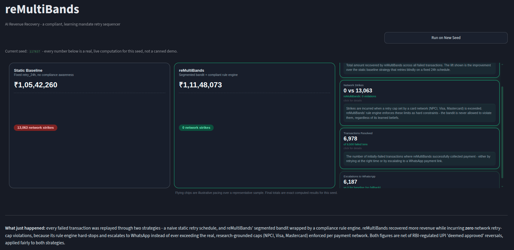
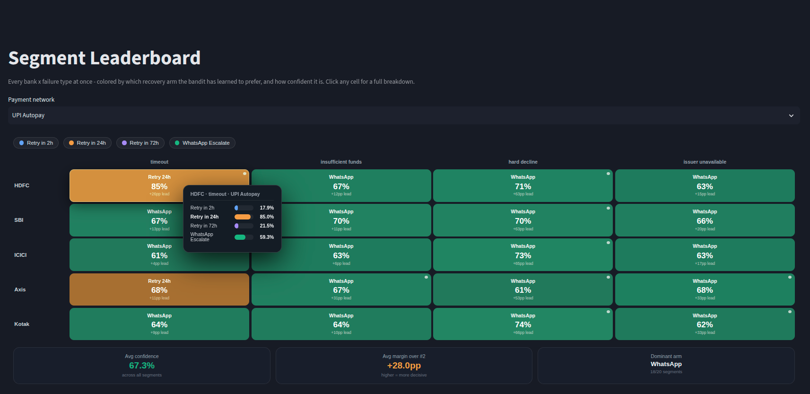
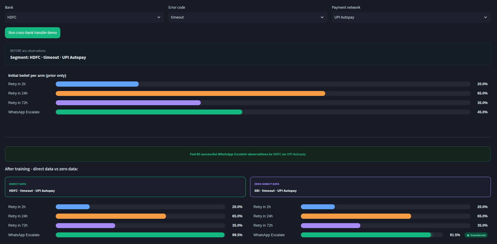
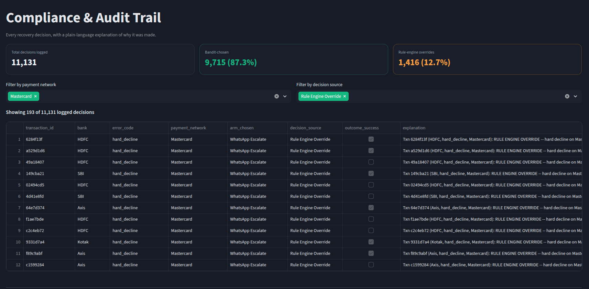
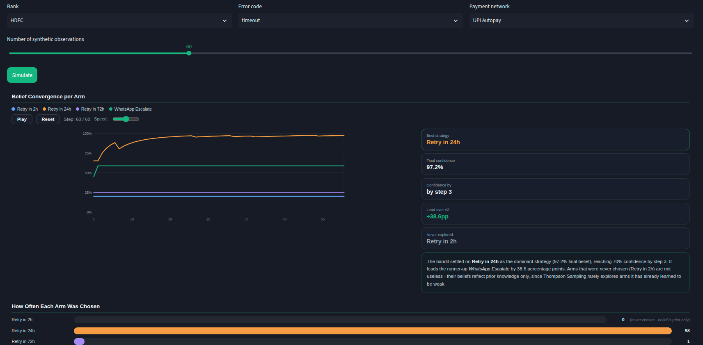
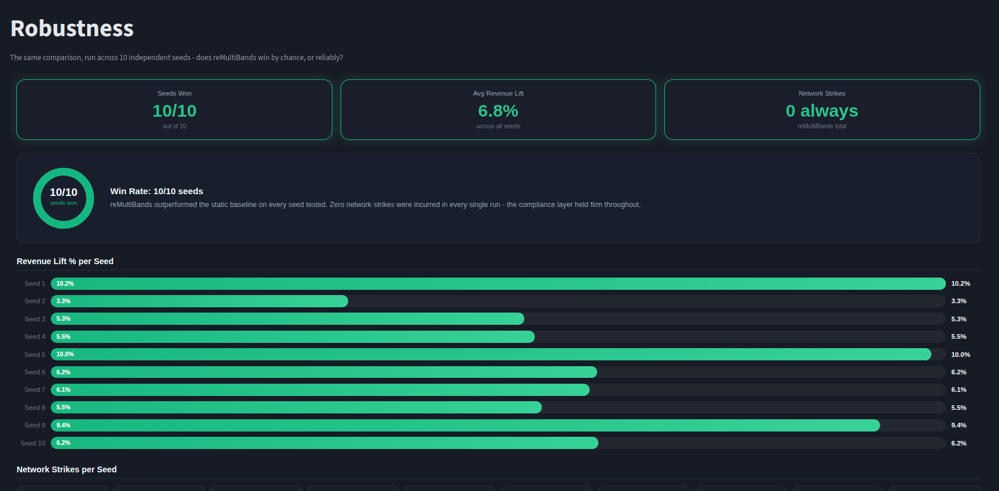

# reMultiBands

**AI Revenue Recovery - a compliant, learning mandate retry sequencer**
Built for Razorpay's hackathon, Track 3: AI Revenue Recovery.

[**Live Demo →**](YOUR_DEPLOYMENT_LINK_HERE)


## The Problem

Failed mandate/subscription payments get retried on a blind, fixed schedule - same delay
every time, regardless of _why_ it failed or _which_ bank/rail was involved. This burns
through hard card-network retry limits (NPCI, Visa, Mastercard), risks merchant penalties,
and drops recoverable revenue.

## The Solution

reMultiBands is a **segmented Thompson Sampling bandit** (the brain) that picks the best
recovery action per bank and failure type, wrapped in a **deterministic rule engine** (the
guardrail) that enforces real regulatory retry caps and force-escalates to a WhatsApp
payment link - a hard guarantee the bandit is never allowed to override.

- Recovers more revenue than a naive static-retry baseline, across every tested seed
- **Zero network strikes, always** - compliance is enforced, not learned
- Every decision logged with a plain-English rationale
- Retry caps grounded in real NPCI, Visa, Mastercard, and RBI regulation - not invented

## Screenshots

| Overview                                   | Segment Leaderboard                                      | Network Effects                                          |
| ------------------------------------------ | -------------------------------------------------------- | -------------------------------------------------------- |
|  |  |  |

| Compliance & Audit                                   | Watch It Learn                                         | Robustness                                     |
| ---------------------------------------------------- | ------------------------------------------------------ | ---------------------------------------------- |
|  |  |  |

## How It Works

```
[ Failed Payment ] → Rule Engine (caps: NPCI/Visa/Mastercard)
                          │
              ┌───────────┴───────────┐
        At/near cap               Healthy budget
              │                        │
     Force WhatsApp            Segmented Bandit
              │                        │
              │            Base Belief (Bank×Error) + Network Belief (Rail)
              │                   combined via additive log-odds
              │                        │
              └──────────┬─────────────┘
                    Action taken → Audit Log → RBI T+5 reversal correction
```

**`engine/bandit.py`** - Segmented Thompson Sampling with an **additive log-odds
decomposition**: a _base_ belief (bank × error code) and a _network_ belief (UPI Autopay,
Visa, Mastercard, RuPay), combined at decision time instead of learned as one diluted
segment. This lets a bank benefit from another bank's experience on the same rail with
zero direct data of its own.

**`engine/rule_engine.py`** - hard caps sourced from real scheme docs: **UPI Autopay: 3
retries** (NPCI, Aug 2025), **Visa: 15** (Excessive Reattempts Rule), **Mastercard: 10**,
**hard declines: 0 retries, any network** (Visa Category 1). Also strips the 72h-wait arm
on a transaction's last attempt (soft zone), and hard-stops into WhatsApp escalation once
the cap is reached.

**`engine/reversal_model.py`** - models RBI's Turn Around Time framework: UPI merchant
payments can sit "deemed approved" and reverse up to **T+5 days** later. Claws back the
revenue and corrects the bandit's posterior so it doesn't learn from a false positive.

Validated against two real production bandit-routing deployments — [Chaudhary et al.
2023](https://arxiv.org/abs/2308.01028) (Dream11) and [Agrawal & Patil
2025](https://arxiv.org/abs/2510.16735)
See the in-app **How It Works** page for full citations and an honest breakdown of what's sourced vs. assumed.

## Dashboard Pages

`Overview` · `How It Works` · `Segment Leaderboard` · `Watch It Learn` · `Compliance & Audit` · `Network Effects` · `Robustness`

## Running Locally

```bash
git clone https://github.com/GurKalra/reMultibands
cd reMultiBands
pip install -r requirements.txt   # or: pip install streamlit pandas
streamlit run dashboard/app.py
```

Run from the project root. Regenerate synthetic data anytime with:

```bash
cd data && python3 generate_data.py
```
